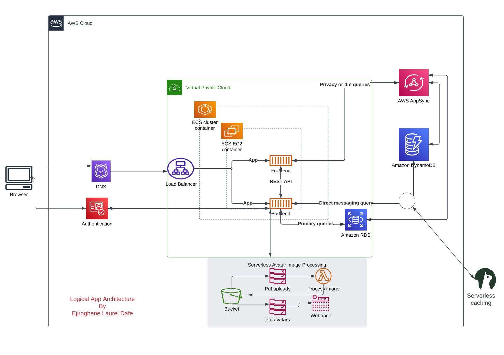
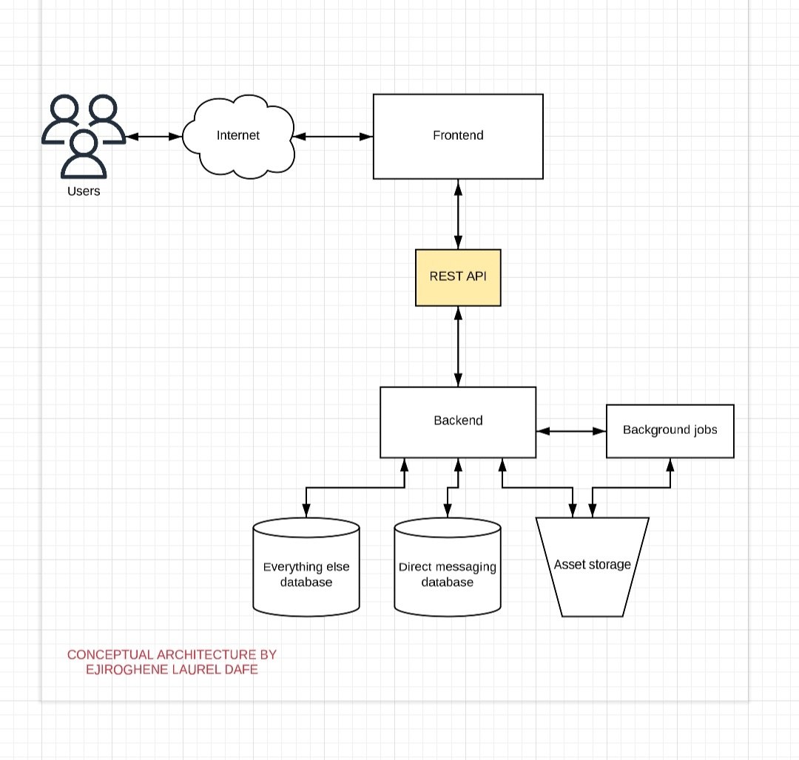
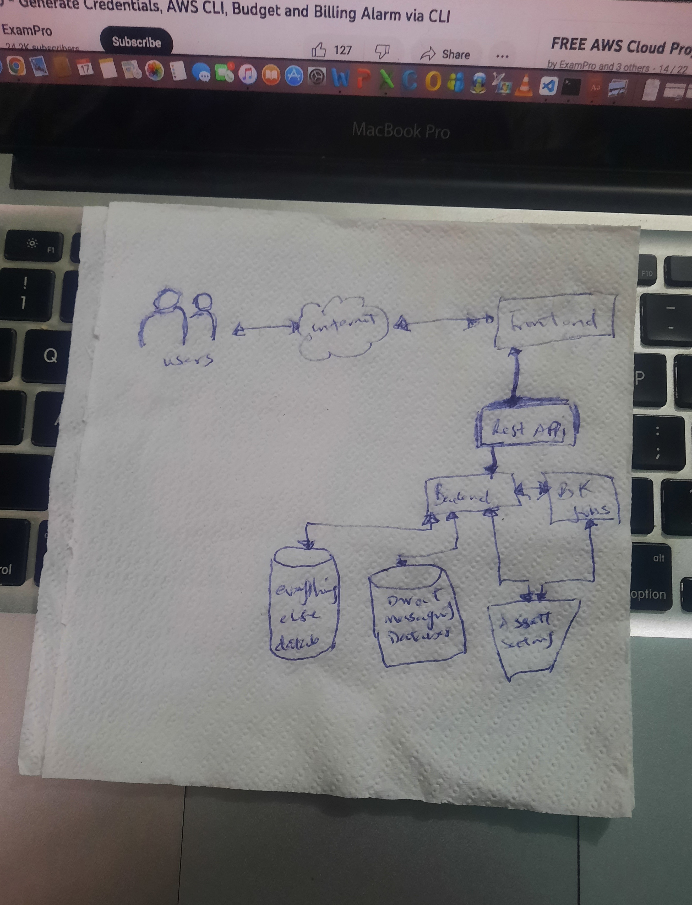

# Week 0 — Billing and Architecture
### Recreate the Logical Architectural Diagram
  

## click [Lucid chart](https://lucid.app/lucidchart/d5f1dd8d-9437-4ee3-9173-d97bc1245cd5/edit?invitationId=inv_c58d319e-0317-4efd-8fc1-54fcffa72612&page=0_0#) to preview Logical diagram.
## click [Lucid chart](https://lucid.app/lucidchart/6f766600-3250-4432-8946-2674134f611b/edit?invitationId=inv_f0aba7cf-4dd9-4fcb-9f50-13584e32682d&page=0_0#) to preview conceptual diagram on lucid chart

  

  

### Installation processes
- I installed AWS CLI in gitpod and added the configuration block to the the gitpod yml file as instructed  
- I added AWS credentials as environment variables with the folloing commands
```bash
export AWS_ACCESS_KEY_ID="accesskey"
export AWS_SECRET_ACCESS_KEY="secretkey"
export AWS_DEFAULT_REGION="us-east-1"
```
- I made sure environment variables will remain in my workspace environment by running:
```bash
gp env AWS_ACCESS_KEY_ID="accesskey"
gp env AWS_SECRET_ACCESS_KEY="secretkey"
gp env AWS_DEFAULT_REGION="us-east-1"
```
- I confirmed my AWS CLI was installed and correctly configured with the command below:
```bash
aws sts get-caller-identity
```

- I created a Billing Alarm and budgets using my account ID on the ClI following the tutorial video made for us
   I got my Account ID by running the following command:
```bash
aws sts get-caller-identity --query Account --output text
```
- I saved the output which was my account ID as an environment variable
```bash
export AWS_ACCOUNT_ID="********2163"
gp env AWS_ACCOUNT_ID="********2163"
```
- I created a [budget.json](https://github.com/EjiroLaurelD/aws-bootcamp-cruddur-2023/blob/main/aws/json/budet.json) file and a [budget-notification-with-subscribers](https://github.com/EjiroLaurelD/aws-bootcamp-cruddur-2023/blob/main/aws/json/budget-notification-with-subscribers.json) file
- I however didn't run the budget commands as i already had 2 budgets set on my account. Trying to stay within free tier.
- Below is the command to run budget on the cli jsut incase
```bash
aws budgets create-budget \
    --account-id $AWS_ACCOUNT_ID \
    --budget file://aws/json/budget.json \
    --notifications-with-subscribers file://aws/json/budget-notification-with-subscribers.json
```
