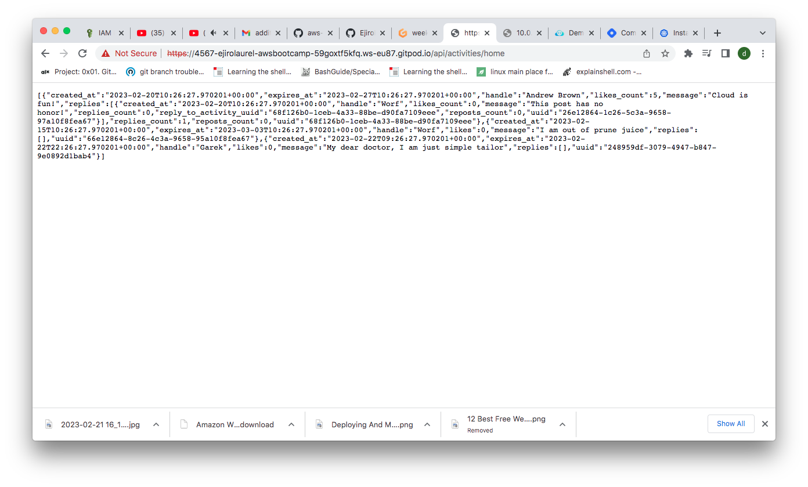
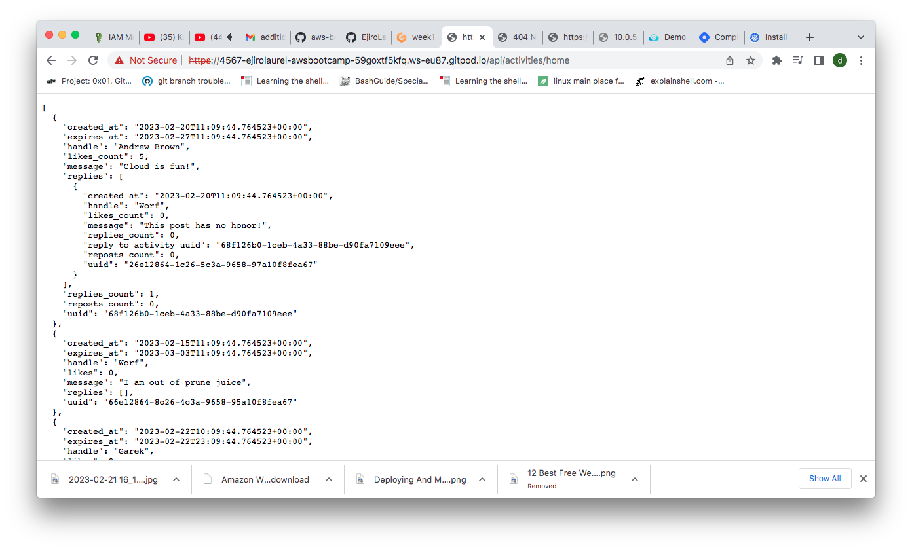
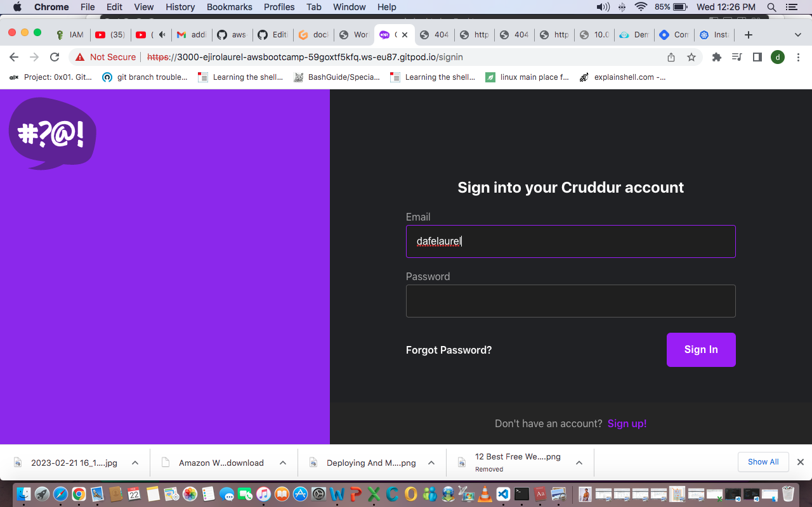
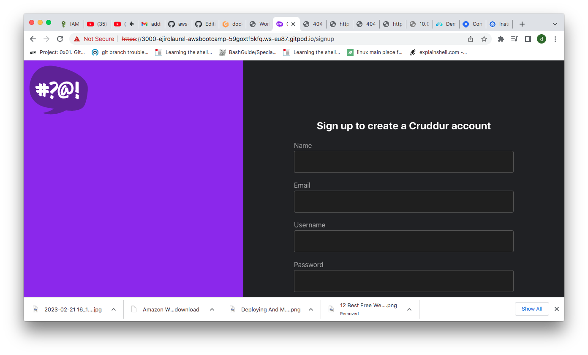
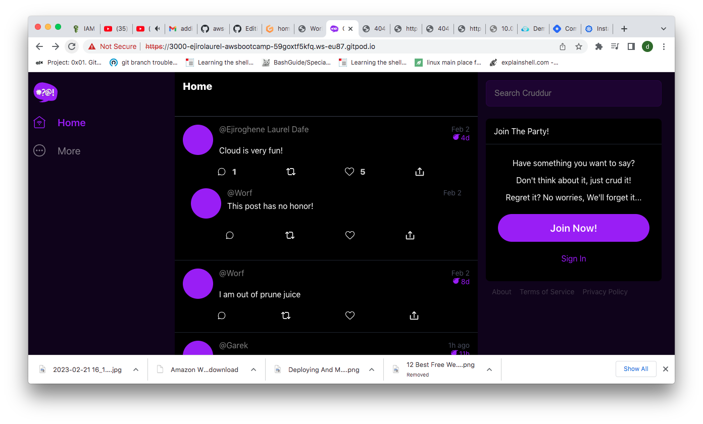

# Week 1 — App Containerization
- I started the week project by creating my docker files in the front and back ends
-  I cd'd into the backend directory and ran the command `pip3 Install -r requirements.txt` to set up my environment
- I added the environment variables and ran the python command to start flask
```
export FRONTEND_URL="*"
export BACKEND_URL="*"
python3 -m flask run --host=0.0.0.0 --port=4567
```

I confirmed my api end point was working with the url https://4567-ejirolaurel-awsbootcamp-59goxtf5kfq.ws-eu87.gitpod.io/api/activities/home
  


I unset my environment variables to be sure it doesnt conflict with docker using the commands
```
unset BACKEND_URL
unset FRONTEND_URL
```

- I cd'd to the work directory /workspace/aws-bootcamp-cruddur-2023 and built the docker image for the backend flask with the command
`docker build -t  backend-flask ./backend-flask` 

- I ran the docker image with the command below with environment variables attached
 `docker run --rm -p 4567:4567 -it -e FRONTEND_URL='*' -e BACKEND_URL='*' backend-flask`

- I confirmed my endpoint was working fine 
https://4567-ejirolaurel-awsbootcamp-59goxtf5kfq.ws-eu87.gitpod.io/api/activities/home
  

After confirming my docker image for the backened i cd'd into the frontend directory and ran npm install
```
cd frontend-react-js
npm i
```
Then i cd'd back to the work directory and created the docker-compose.yml file with the code 

```
version: "3.8"
services:
  backend-flask:
    environment:
      FRONTEND_URL: "https://3000-${GITPOD_WORKSPACE_ID}.${GITPOD_WORKSPACE_CLUSTER_HOST}"
      BACKEND_URL: "https://4567-${GITPOD_WORKSPACE_ID}.${GITPOD_WORKSPACE_CLUSTER_HOST}"
    build: ./backend-flask
    ports:
      - "4567:4567"
    volumes:
      - ./backend-flask:/backend-flask
  frontend-react-js:
    environment:
      REACT_APP_BACKEND_URL: "https://4567-${GITPOD_WORKSPACE_ID}.${GITPOD_WORKSPACE_CLUSTER_HOST}"
    build: ./frontend-react-js
    ports:
      - "3000:3000"
    volumes:
      - ./frontend-react-js:/frontend-react-js

# the name flag is a hack to change the default prepend folder
# name when outputting the image names
networks: 
  internal-network:
    driver: bridge
    name: cruddur
```

- I ran `docker ccompose up` to start docker compose. I unlocked my ports and previewed the app on port 3000  https://3000-ejirolaurel-awsbootcamp-59goxtf5kfq.ws-eu87.gitpod.io/
## Cruddr App Home page
 

## Sign in page
 

## Sign up page
  

## Edited backend homepage
- Here i edited the backend services file, home-activities.py to edit Handler "Andrew Brown" to my name and "Cloud is fun" to "Cloud is very fun"
  


