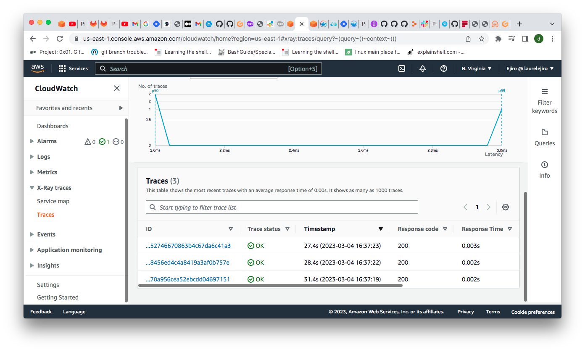

# Week 2 — Distributed Tracing

- I signed up on honeycomb and created an environment called bootcamp
- I got my api key and i exported it as an environment variable 
- export HONEYCOMB_API_KEY=redacted
- gp env HONEYCOMB_API_KEY=redacted

- I Instrumented the backend  application to use Open Telemetry(OTEL) with honeycomb.io as the provider
```
      OTEL_SERVICE_NAME: "backend-flask"
      OTEL_EXPORTER_OTLP_ENDPOINT: "https://api.honeycomb.io"
      OTEL_EXPORTER_OTLP_HEADERS: "x-honeycomb-team=${HONEYCOMB_API_KEY}"
```
 
- I Installed these packages on my terminal to instrument a Flask app with OpenTelemetry:
```
pip install opentelemetry-api \
    opentelemetry-sdk \
    opentelemetry-exporter-otlp-proto-http \
    opentelemetry-instrumentation-flask \
    opentelemetry-instrumentation-requests
```
  
- I added the following to my requirement.txt file
```
opentelemetry-api 
opentelemetry-sdk 
opentelemetry-exporter-otlp-proto-http 
opentelemetry-instrumentation-flask 
opentelemetry-instrumentation-requests
```

- I installed the dependencies using 
`pip install -r requirements.txt` 

- I added the following to apps.py from Honeycomb
```
from opentelemetry import trace
from opentelemetry.instrumentation.flask import FlaskInstrumentor
from opentelemetry.instrumentation.requests import RequestsInstrumentor
from opentelemetry.exporter.otlp.proto.http.trace_exporter import OTLPSpanExporter
from opentelemetry.sdk.trace import TracerProvider
from opentelemetry.sdk.trace.export import BatchSpanProcessor
```

```
# Initialize tracing and an exporter that can send data to Honeycomb
provider = TracerProvider()
processor = BatchSpanProcessor(OTLPSpanExporter())
provider.add_span_processor(processor)
trace.set_tracer_provider(provider)
tracer = trace.get_tracer(__name__)
```

```
# Initialize automatic instrumentation with Flask
FlaskInstrumentor().instrument_app(app)
RequestsInstrumentor().instrument()
```


- I ran npm install nmp i then docker compose up


- I copied the codes from https://docs.honeycomb.io/getting-data-in/opentelemetry/python/  to create spans in home.activities file
- I ran queries to see the traces within Honeycomb.

  
  


#### AWS XRAY
cd into back-end flask , create xray.json file 

```
{
  "SamplingRule": {
      "RuleName": "Cruddur",
      "ResourceARN": "*",
      "Priority": 9000,
      "FixedRate": 0.1,
      "ReservoirSize": 5,
      "ServiceName": "Cruddur",
      "ServiceType": "*",
      "Host": "*",
      "HTTPMethod": "*",
      "URLPath": "*",
      "Version": 1
  }
}
```

 - Then I created xray on the terminal using code below 

 ```
  xray create-group \
   --group-name "Cruddur" \
 --filter-expression "service(\"backend-flask\")"
```
  

- I created sampling rules with the code
`aws xray create-sampling-rule --cli-input-json file://aws/json/xray.json`

- I configured and provisioned X-Ray daemon within docker-compose and sent data back to X-Ray API.
```
  xray-daemon:
    image: "amazon/aws-xray-daemon"
    environment:
      AWS_ACCESS_KEY_ID: "${AWS_ACCESS_KEY_ID}"
      AWS_SECRET_ACCESS_KEY: "${AWS_SECRET_ACCESS_KEY}"
      AWS_REGION: "us-east-1"
    command:
      - "xray -o -b xray-daemon:2000"
    ports:
      - 2000:2000/udp
```
- I also added these environment variables to my docker compose file
```
      AWS_XRAY_URL: "*4567-${GITPOD_WORKSPACE_ID}.${GITPOD_WORKSPACE_CLUSTER_HOST}*"
      AWS_XRAY_DAEMON_ADDRESS: "xray-daemon:2000"
```
- I edited the app.py file to implement AWS X-Ray into backend flask application

```
from aws_xray_sdk.core import xray_recorder
from aws_xray_sdk.ext.flask.middleware import XRayMiddleware

xray_url = os.getenv("AWS_XRAY_URL")
xray_recorder.configure(service='Cruddur', dynamic_naming=xray_url)
XRayMiddleware(app, xray_recorder)
```
- I ran docker compose up and xray traces was successfully sent
- I observed the X-Ray traces within the AWS Console.
  
  
  
  


- I Configured custom logger to send logs to CloudWatch Logs	
  
  
  

- I created a roll bar account and set up my token as an environment varialble
```
export ROLLBAR_ACCESS_TOKEN="redacted"
gp env ROLLBAR_ACCESS_TOKEN="redacted"
```
- I integrated roll bar for error logging by adding the codes below to my app.py file
```
import os
import rollbar
import rollbar.contrib.flask
from flask import got_request_exception
```
```
rollbar_access_token = os.getenv('ROLLBAR_ACCESS_TOKEN')
@app.before_first_request
def init_rollbar():
    """init rollbar module"""
    rollbar.init(
        # access token
        rollbar_access_token,
        # environment name
        'production',
        # server root directory, makes tracebacks prettier
        root=os.path.dirname(os.path.realpath(__file__)),
        # flask already sets up logging
        allow_logging_basic_config=False)

    # send exceptions from `app` to rollbar, using flask's signal system.
    got_request_exception.connect(rollbar.contrib.flask.report_exception, app)
```

- I added endpoint to check error triggered with rollbar
```
@app.route('/rollbar/test')
def rollbar_test():
    rollbar.report_message('Hello World!', 'warning')
    return "Hello World!"
```
  

- I added roll bar to my docker compose file 
`ROLLBAR_ACCESS_TOKEN: "${ROLLBAR_ACCESS_TOKEN}"`

- I ran docker compose up and observed the error in rollbar
  
  
  

